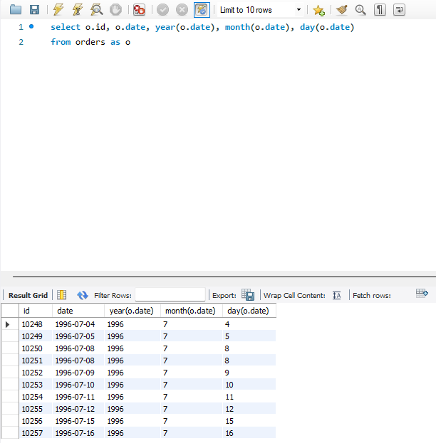
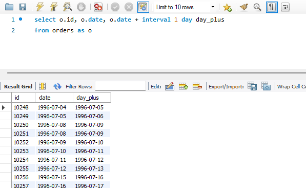
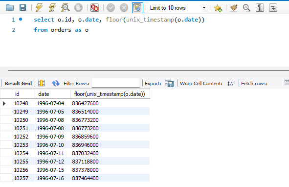
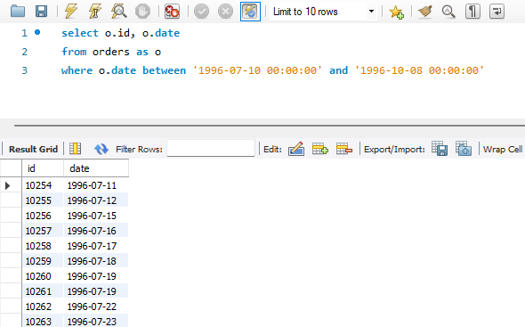
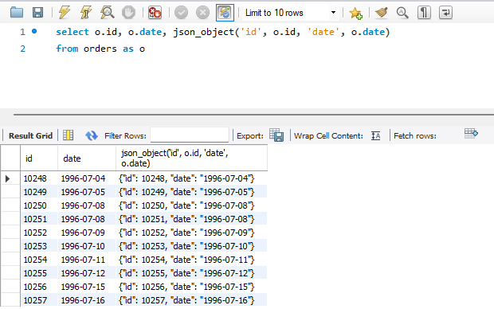

# Домашнє завдання до Теми 7. Додаткові вбудовані SQL функції. Робота з часом

## 1. Напишіть SQL-запит, який для таблиці orders з атрибута date витягує рік, місяць і число. Виведіть на екран їх у три окремі атрибути поряд з атрибутом id та оригінальним атрибутом date (всього вийде 5 атрибутів).

[DQL запит](p1_dql.sql)

## 2. Напишіть SQL-запит, який для таблиці orders до атрибута date додає один день. На екран виведіть атрибут id, оригінальний атрибут date та результат додавання.

[DQL запит](p2_dql.sql)

## 3. Напишіть SQL-запит, який для таблиці orders для атрибута date відображає кількість секунд з початку відліку (показує його значення timestamp). Для цього потрібно знайти та застосувати необхідну функцію. На екран виведіть атрибут id, оригінальний атрибут date та результат роботи функції.

[DQL запит](p3_dql.sql)

## 4. Напишіть SQL-запит, який рахує, скільки таблиця orders містить рядків з атрибутом date у межах між 1996-07-10 00:00:00 та 1996-10-08 00:00:00.

[DQL запит](p4_dql.sql)

## 5. Напишіть SQL-запит, який для таблиці orders виводить на екран атрибут id, атрибут date та JSON-об’єкт {"id": <атрибут id рядка>, "date": <атрибут date рядка>}. Для створення JSON-об’єкта використайте функцію.

[DQL запит](p5_dql.sql)

